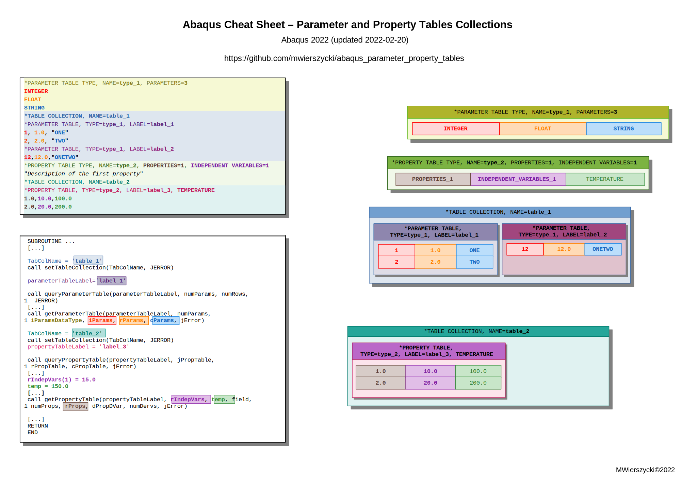

# Parameter and Property Table Collections in Abaqus

Passing large amounts of input data to user subroutines in Abaqus has been quite challenging for many years. Parameters from the INP file can be passed directly to specific subroutine (e.g. `UMAT`) only. There are dedicated subroutines (e.g. `[V]UEXTERNALDB`) to read data from files as well. Since version 2019 the new functionality is available in Abaqus to access data defined in INP file (in the form of tables) from any user subroutines directly - Parameter and Property Table Collections.

Table collections:

- can contain two types of tables: parameter tables and property tables,
- parameter table can contain records with integer, float, or string data fields,
 - property tables define float properties as a function of independent variables, temperature, or predefined field variables (in a similar fashion like the definition of material properties) including table lookup evaluation.

Table collection is a container which encapsulates parameter and/or property tables. The Abaqus documentation says that the number of table collections defined in the INP file is not limited:

> ... *Any number of table collections can be defined in an analysis.* ...

It's partially true. There is no explicitly defined limit but in the case of a very large number of table collections the syntax check driver hangs. The number of table collections shouldn't significantly exceed ~1 000 000 (verified in Abaqus 2022 on Linux). Moreover, please note that the whole size of parameter and property table collections is limited due to memory limits as well.

The table collection is defined using keyword:
```
*TABLE COLLECTION, NAME=table_collection_name
```

The name has to be set for each table collection separately. This name is used to access table collections from user subroutine. It's worth to note the classical Abaqus material definition `*MATERIAL` can be used as a table collection and can be accessed from user subroutines in the same way but only in the user subroutines invoked in the context of this material. 

The `*TABLE COLLECTION` keyword starts the data block in which parameter and property tables of this collection are defined. The general Abaqus input deck syntax rules apply in the parameter and property table collection definitions.

Before parameter and/or property table collection are defined, the records of that tables have to be declared using the keywords:
```
*PARAMETER TABLE TYPE, NAME=type_name, PARAMETERS=n
*PROPERTY TABLE TYPE, NAME=type_name, PROPERTIES=n, INDEPENDENT VARIABLES=n
```
The record declaration determines the number and the type of parameters in the table. The default value for each parameter can be set as well. The record type needs to bear a name. The record declaration has a global range. It must be unique for the whole model. The declaration of parameter table type has to contain the number of parameters - the record fields. Here is a simple example of the parameter table record declaration with three fields: integer, float and string:
```
*PARAMETER TABLE TYPE, NAME=TYPE_1, PARAMETERS=3
INTEGER
FLOAT
STRING
```
In the case of property table record type, the number of fields is not given directly. The property table record consists of the following fields: properties, independent variables,  temperature and predefined field variables. The temperature and predefined field variables are not declared explicitly - their definition follows the same convention which is used for the definition of material data. A simple example of the property tables record declaration with three fields: one property, one independent variable and temperature (predefined field variables are not used in this case) is shown below:
```
*PROPERTY TABLE TYPE, NAME=TYPE_2, PROPERTIES=1, INDEPENDENT VARIABLES=1
"Description of the first property"
```
Description of the property is optional.

The parameter table is defined using the keyword:
```
*PARAMETER TABLE, TYPE=type_name, LABEL=label_name
```
Multiple parameter tables of the same type can be defined in the model. In the case of existing multiple tables of the same type in the same table collection, a label must be assigned to these parameter tables. Both name and label are used to access a table from user subroutine. A simple example of the parameter table definition based on type declared before is shown below:
```
*PARAMETER TABLE, TYPE=TYPE_1, LABEL=LABEL_1
1, 1.0, "ONE"
2, 2.0, "TWO"
```
As was mentioned before, a property table defines properties such as function of independent variables, temperature, or field variables. Abaqus can interpolate linearly a property value when requested between given variables and/or temperature. The property table data must be defined in the order of increasing values of the independent variable, temperature, or predefined field variable. In the case of one property, the syntax is obvious but for two and more properties it can be a little bit tricky. See [Input Syntax](https://help.3ds.com/2022/English/DSSIMULIA_Established/SIMACAEMODRefMap/simamod-c-inputsyntax.htm?contextscope=all) Rules in Abaqus documentation for more details. A simple example of the parameter table definition based on the type declared before looks as follow:
```
*PROPERTY TABLE, TYPE=TYPE_2, LABEL=LABEL_3, TEMPERATURE
1.0,10.0,100.0
2.0,20.0,200.0
```
Outside of the defined range of independent variables, the constant extrapolation of properties value is used by default. The linear extrapolation can be used in place of using `EXTRAPOLATION=LINEAR` option.

Due to performance issues in the case of Abaqus/Explicit, the property table data are regularized by default. It can be switched off using options `REGULARIZE=OFF` but is not recommended. More information on the regularization process can be found in Abaqus documentation ([Regularizing User-Defined Data in Abaqus/Explicit](https://help.3ds.com/2022/English/DSSIMULIA_Established/SIMACAEMATRefMap/simamat-c-materialdata.htm?contextscope=all#simamat-c-materialdata-regularizing)).

The INP syntax of parameter and property table collections is well explained in [Abaqus documentation](https://help.3ds.com/2022/English/DSSIMULIA_Established/SIMACAEANLRefMap/simaanl-c-subroutinetables.htm?contextscope=all). However, the access to tables from user subroutines can be much more challenging. The graphical cheat sheet can helps to use parameter and property tables in your subroutines:



A simple example of using parameter and property tables in `UTEMP` subroutine is available as well:
```
 SUBROUTINE UTEMP(TEMP,NSECPT,KSTEP,KINC,TIME,NODE,COORDS)
 [...]
 TabColName = 'TABLE_1'
 call setTableCollection(TabColName, JERROR)
      
 parameterTableLabel="LABEL_1"

 call queryParameterTable(parameterTableLabel, numParams,
1   numRows, JERROR)

 [...]

 call getParameterTable(parameterTableLabel, numParams,
1 iParamsDataType, iParams, rParams, cParams, jError)

 [...]

 TabColName = 'TABLE_2'
 call setTableCollection(TabColName, JERROR)
 propertyTableLabel = 'LABEL_3'
 
 call queryPropertyTable(propertyTableLabel, jPropTable,
1 rPropTable, cPropTable, jError)

 [...]

 rIndepVars(1) = 15.0
 temp = 150.0

 [...]

  call getPropertyTable(propertyTableLabel, rIndepVars,
1 temp, field, numProps, rProps, dPropDVar, numDervs, jError)
 [...]
 END
```
The full source code of subroutine is available on here:
- [utemp_c3d8_1elem_tabels.f](utemp_c3d8_1elem_tabels.f)
- [utemp_c3d8_1elem_tabels.inp](utemp_c3d8_1elem_tabels.inp)

Parameter and Property Tables can be very useful in the case of user subroutines that do not provide an interface to pass input data. Instead of using hard-coded values inside the user subroutine or reading data from external files, input data can be easily provided as a part of the model in an INP file and read in any subroutine.

Happy using parameter and property tables!
